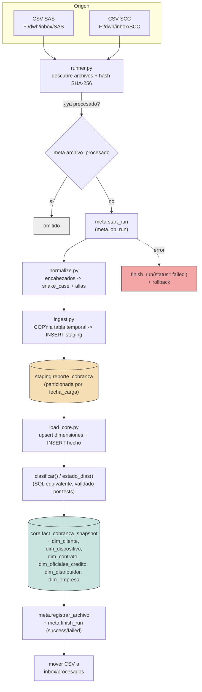
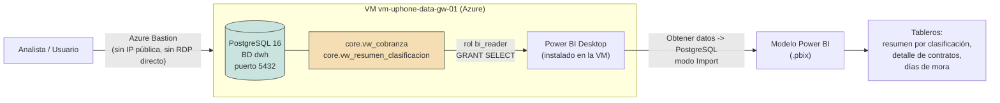

# DWH Cobranza — ETL CSV → PostgreSQL → Power BI

ETL en Python que ingiere los reportes diarios de cobranza de **SAS** y **SCC** (CSV exportados desde SAP) hacia un data warehouse en **PostgreSQL** (staging → modelo estrella en `core`), aplicando reglas de negocio de clasificación y estado de mora, con snapshots diarios históricos listos para consumir desde **Power BI**.

## Stack

- **Python 3.12** — lógica pura testeable (normalización de columnas, motor de reglas) separada de la capa de datos.
- **PostgreSQL 16/18** — esquemas `staging`, `core`, `meta`; tablas particionadas por `fecha_carga`.
- **pytest** — suite con marker `db` para tests de integración contra Postgres.
- **Power BI Desktop** — consumo en modo *Import* sobre vistas de `core`.
- Orquestación diaria vía Programador de tareas de Windows (`run_etl.bat`) en la VM de producción.

## Estructura del repo

```
etl/
  config/empresas.yaml          # inbox, patrón de archivo y overrides por empresa
  src/etl/
    normalize.py                # snake_case ASCII + alias canónicos
    rules.py                    # clasificar() + estado_dias()
    config.py                   # carga de empresas.yaml + .env
    db.py                       # conexión + helper COPY
    meta.py                     # control: job_run, archivo_procesado, particiones
    ingest.py                   # CSV -> staging (tabla temporal + COPY)
    load_core.py                # staging -> dimensiones + hecho con reglas
    runner.py                   # orquestador de la corrida diaria
  tests/                        # unitarios (puros) + integración (marker db)
sql/
  01_schema_roles.sql            # esquemas + roles etl_app / bi_reader
  02_meta.sql                    # control y partición automática
  03_staging.sql                 # staging.reporte_cobranza (particionada)
  04_core.sql                    # dimensiones + fact_cobranza_snapshot
  05_views.sql                   # vw_cobranza, vw_resumen_clasificacion
  06_postgresql.conf.md          # tuning recomendado (32 GB RAM)
docs/
  setup-vm.md                    # checklist corto de despliegue en la VM
  despliegue-vm.md               # plan de despliegue + guía de ejecución diaria
  prueba-piloto.md                # guía de prueba local end-to-end
```
> `run_etl.bat` (entrypoint del Programador de tareas) se crea en la VM; su
> contenido está en [`docs/despliegue-vm.md`](docs/despliegue-vm.md).

## Reglas de negocio

| Regla | Condición | Resultado |
|---|---|---|
| `clasificar()` | `monto_por_cobrar = 0` | `EXCLUIDO` |
| | `monto_por_cobrar > 0` y `valor_en_mora = 0` | `PREVENTIVA` |
| | `monto_por_cobrar > 0` y `valor_en_mora > 0` | `MORA` |
| `estado_dias()` | `dias_impago` nulo | `SIN_DATO` |
| | `dias_impago < 0` | `ADELANTADO` |
| | `dias_impago = 0` | `AL_DIA` |
| | `dias_impago > 0` | `EN_MORA` |

## Modelo dimensional (`core`)

Esquema estrella: el hecho `fact_cobranza_snapshot` (snapshot diario, una fila por
contrato × `fecha_carga`) referencia 6 dimensiones.

| Dimensión | Contenido |
|---|---|
| `dim_empresa` | Empresa emisora (SAS / SCC) |
| `dim_cliente` | Cédula + datos de contacto |
| `dim_dispositivo` | IMEI, marca, modelo |
| `dim_contrato` | N.º contrato, fecha venta, grupo, estado |
| `dim_distribuidor` | Punto de venta (columna `distribuidor` del CSV) |
| `dim_oficiales_credito` | Vendedor + los 4 `oficial_credito_*` |

## Flujo de ejecución del ETL



Ejecución diaria: **Programador de tareas de Windows** (`DWH_ETL_Diario`, 06:00 AM) corre `run_etl.bat` → activa el `.venv` → `python -m etl.runner` sobre `config/empresas.yaml`. Cada corrida es idempotente (se dedupe por hash de archivo) y queda auditada en `meta.job_run`.

## Conexión y consumo desde Power BI



- El rol **`bi_reader`** tiene solo `SELECT` sobre el esquema `core` (vistas `vw_cobranza` y `vw_resumen_clasificacion`); el rol **`etl_app`** es el que escribe (staging/core/meta).
- Power BI se conecta en modo **Import** (no DirectQuery) y se refresca manualmente tras cada corrida del ETL.
- No hay gateway ni IP pública: el acceso a la VM es únicamente vía **Azure Bastion**.

## Pruebas

```powershell
cd etl
$env:PYTHONPATH="src"
.\.venv\Scripts\python.exe -m pytest -m "not db"   # 24 tests puros (normalize, rules, config, runner)
.\.venv\Scripts\python.exe -m pytest -m db          # 7 tests de integración (requiere TEST_DATABASE_URL)
```

Guía completa de prueba end-to-end local (DBVisualizer + servidor Postgres de pruebas en :5433): [`docs/prueba-piloto.md`](docs/prueba-piloto.md).

## Despliegue en producción

- Guía completa (plan de despliegue + ejecución diaria + actualización de un `core` existente): [`docs/despliegue-vm.md`](docs/despliegue-vm.md).
- Checklist corto de provisión: [`docs/setup-vm.md`](docs/setup-vm.md).

## Estado

Las 11 tareas del [plan de implementación](docs/superpowers/plans/2026-06-23-dwh-cobranza-etl.md) están completas y validadas contra datos reales (212.329 filas, 2026-06-22). El modelo `core` se reorganizó a pedido: `distribuidor` pasó a su propia `dim_distribuidor` y la antigua `dim_gestor` se renombró a `dim_oficiales_credito` (misma distribución EXCLUIDO/PREVENTIVA/MORA). Pendiente: despliegue efectivo en la VM de producción.
